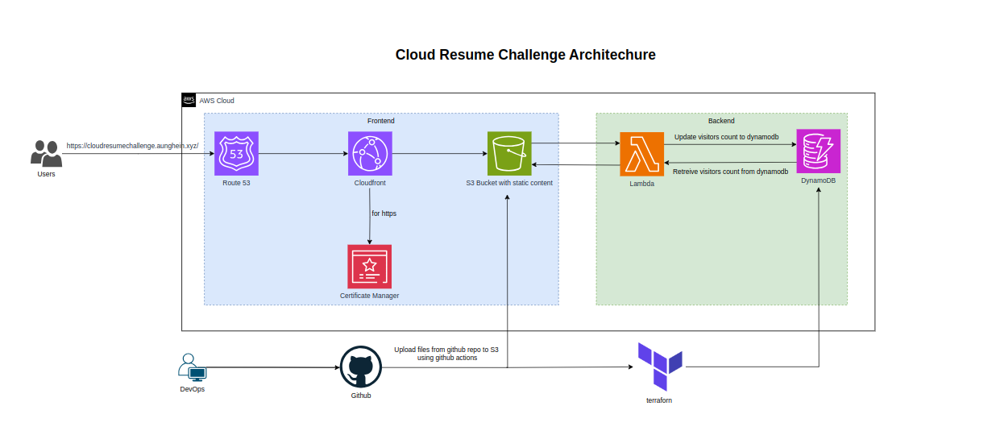

# My Journey with AWS Cloud Resume Challenge

In this project, I completed the AWS Cloud Resume Challenge by leveraging various AWS services and CI/CD tools. 

The steps involved creating a portfolio using HTML/CSS, hosting the static website on an S3 bucket, configuring Route 53 for DNS management, securing the site with SSL/TLS certificates from AWS Certificate Manager, and setting up CloudFront for efficient content delivery. 

Additionally, I implemented a Lambda function to track the number of visitors and stored the data in DynamoDB. 

To automate the deployment process, I used GitHub Actions for continuous integration and deployment and Terraform for infrastructure as code to manage the Lambda and DynamoDB resources.

Check out the final result at [link](https://cloudresumechallenge.aunghein.xyz/)

## Architechure

For a detailed step-by-step guide, check out my notes on [Notion](https://aunghein99.notion.site/My-Journey-with-AWS-Cloud-Resume-Challenge-02fe7c3f717e408bb14cd22b8f4c9d9e)

You can also find the project repository on [GitHub](https://aunghein99.notion.site/My-Journey-with-AWS-Cloud-Resume-Challenge-02fe7c3f717e408bb14cd22b8f4c9d9e?pvs=4)

